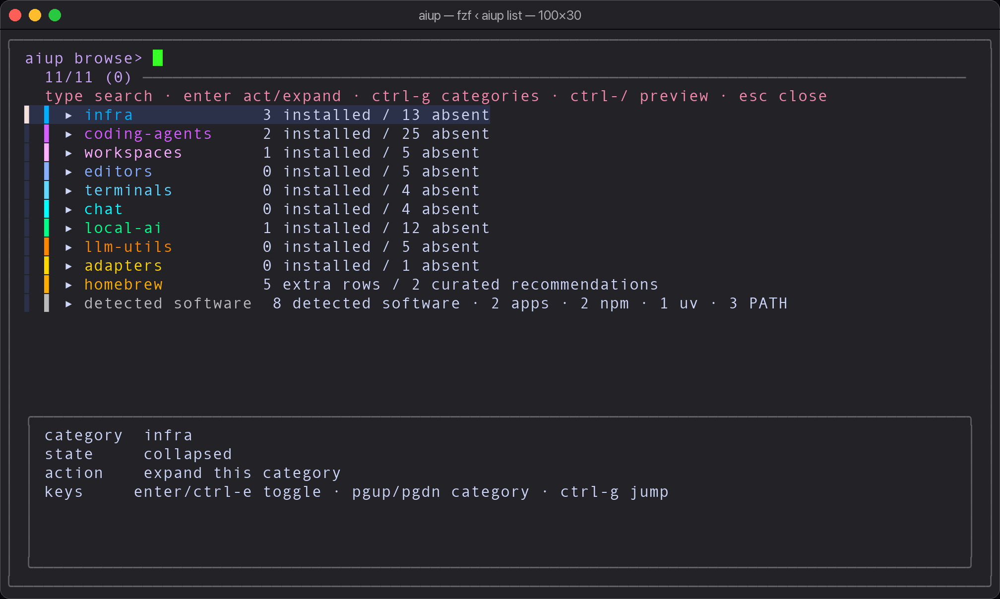
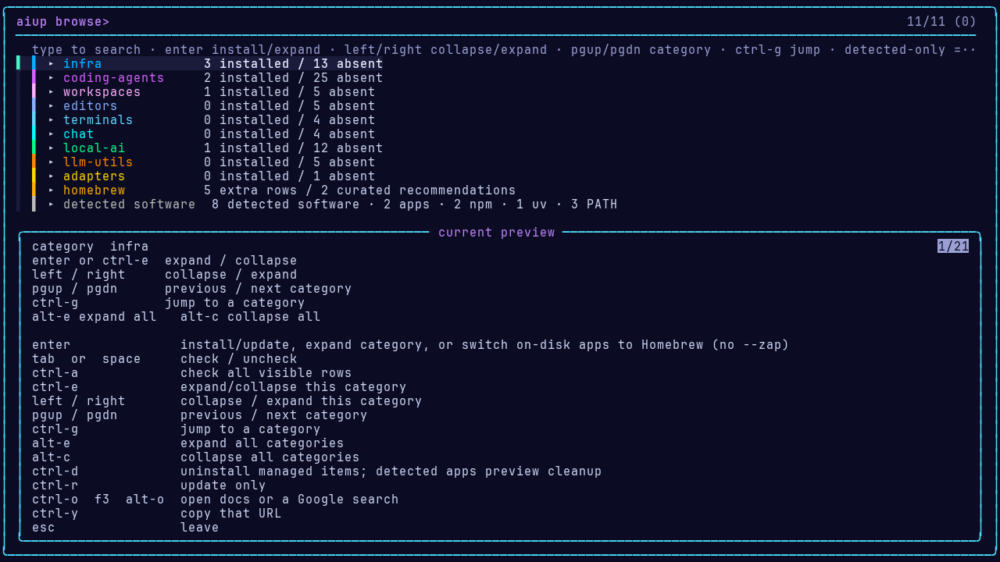
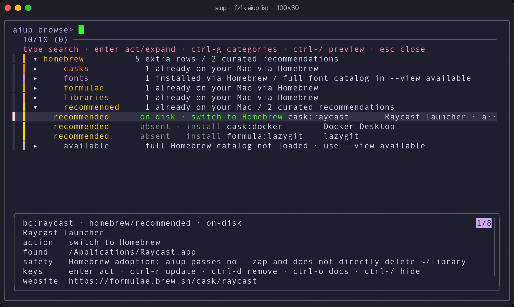
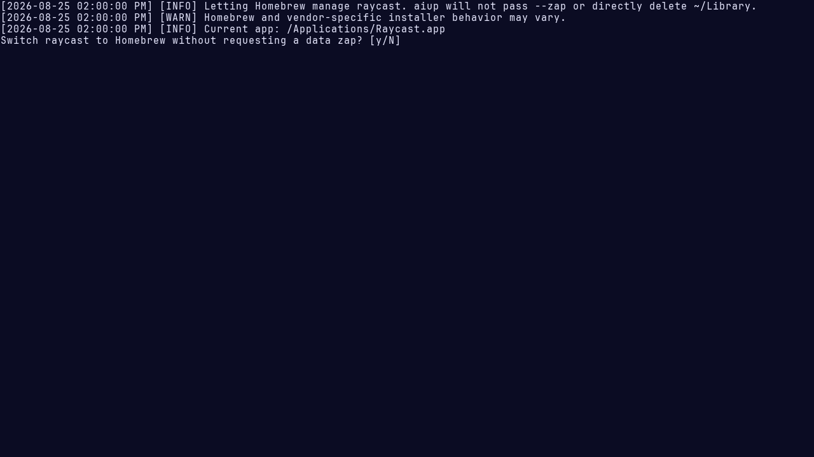

<p align="center">
  
</p>

<p align="center">
  <strong>Scan your Mac. Update what you already have. Install or remove from a full-screen list.</strong><br/>
  Local inventory is never uploaded. aiup itself requires no account.
</p>

<p align="center">
  
  
  
  
</p>

<p align="center">
  <a href="https://aiup.neuman.dev">🌐 aiup.neuman.dev</a>
  ·
  <a href="https://github.com/travisjneuman/aiup">⭐ GitHub</a>
  ·
  <a href="docs/install.md">⬇️ Install</a>
  ·
  <a href="docs/catalog.md">📚 Catalog</a>
  ·
  <a href="docs/privacy.md">🔒 Privacy</a>
</p>

---

<p align="center">
  
</p>

<p align="center"><em>⏎ install or expand &nbsp;·&nbsp; ⌃D uninstall &nbsp;·&nbsp; ⌃O docs &nbsp;·&nbsp; esc done</em></p>

## ⚡ One minute

```bash
curl -fsSL https://raw.githubusercontent.com/travisjneuman/aiup/main/macos/install-aiup | bash
export PATH="$HOME/.local/bin:$PATH"
aiup only fzf
aiup list
```

| You type | What happens |
|---|---|
| `aiup` | 🔍 Ensure fzf, scan your Mac → update **installed** tools |
| `aiup list` | 🎛️ Full-screen catalog |
| `aiup only grok` | 📦 Install or update one tool |
| `aiup doctor` | 🩺 How each tool was detected |

### 🔄 Always live

The installed command fetches the public runtime and matching catalog manifest from GitHub on every invocation, validates both, stages them as one pair, then serializes finalization and atomically switches a single `current-generation` pointer. `previous-generation` preserves the former complete validated pair as recovery evidence; older unreferenced aiup generations are pruned, so repeated successes retain at most those two complete pairs. An overlapping invocation's hidden staging directory is never pruned, and a live activation lock is never reclaimed. A failed, empty, invalid, partial, locked, or unactivatable refresh stops without executing the download or an older cache. Public use therefore needs network access at the start of every run.

Repository contributors can opt into an offline local checkout for one invocation by deliberately setting `AIUP_SOURCE_PATH` to that checkout's `macos/aiup` file. No checkout path is guessed or probed by default.

Normal package updates are unattended: Homebrew package confirmations are accepted automatically, and version checks cannot wait for terminal input. The initial Homebrew bootstrap is the exception and runs its official installer interactively for confirmation and any administrator authentication. A Homebrew tap already installed on the Mac is treated as prior user approval and trusted automatically; a missing tap required by a selected tool prompts before it is added and trusted. Explicit uninstall and on-disk app-switch confirmations also require your approval.

Official desktop apps that are not Homebrew-managed can declare a lightweight update manifest in the catalog. aiup checks that manifest against the installed bundle version first, downloads the large installer only when a newer release exists, and validates the replacement before activation. Screenpipe uses this path; aiup replaces only its app bundle and does not remove its configured settings or capture paths.

## ✨ Why people keep it

<table>
<tr>
<td width="50%">

### 🔍 Scan, don't spray
Default `aiup` keeps optional tools from coming back, but restores required infrastructure such as fzf.

</td>
<td width="50%">

### 🚫 No direct sudo
aiup does not invoke `sudo` directly. Its user-prefix installs keep Node CLIs in `~/.local/share/aiup/npm`; Homebrew's official initial installer may separately request administrator authentication.

</td>
</tr>
<tr>
<td>

### 🍺 Homebrew, honestly
Child lists are **your Mac**, plus a short recommended set — not all of Homebrew.

</td>
<td>

### 🔒 Inventory stays local
PATH, app bundles, and package inventory are never uploaded. Runtime and package refreshes still use the network. [Privacy →](docs/privacy.md)

</td>
</tr>
</table>

### 🔎 Your Mac, not a hardcoded demo

The managed catalog is curated around reviewed install/update/remove contracts. The picker also discovers four kinds of software that are not yet managed: app bundles, global npm packages, uv tools, and user-facing PATH binaries. Those rows are clearly marked detected-only, counted by source, and kept separate from Homebrew's installed inventory. aiup has not verified an updater/remover contract for them yet, so it will not guess how to update them.

<p align="center">
  
  
</p>

## 🎛️ Keys

| Key | Action |
|---|---|
| <kbd>enter</kbd> | Expand a category, install/update a tool, or **switch an on-disk app to Homebrew** |
| <kbd>tab</kbd> / <kbd>space</kbd> | Check / uncheck |
| <kbd>ctrl</kbd>+<kbd>e</kbd> | Toggle this category |
| <kbd>←</kbd> / <kbd>→</kbd> | Collapse / expand this category |
| <kbd>pgup</kbd> / <kbd>pgdn</kbd> | Jump to the previous / next category |
| <kbd>ctrl</kbd>+<kbd>g</kbd> | Open a searchable category-jump palette |
| <kbd>alt</kbd>+<kbd>e</kbd> / <kbd>alt</kbd>+<kbd>c</kbd> | Expand / collapse all |
| <kbd>ctrl</kbd>+<kbd>d</kbd> | Uninstall managed items; preview cleanup for detected apps |
| <kbd>ctrl</kbd>+<kbd>o</kbd> | Open GitHub, the product site, or a Google search for detected software |
| <kbd>ctrl</kbd>+<kbd>/</kbd> | Toggle the preview pane |
| <kbd>esc</kbd> | Leave |

Type to search the entire catalog, including rows inside collapsed categories; clearing the query restores the compact collapsed overview. The picker remembers its last query and category locally, so reopening it resumes navigation without changing the default collapsed overview. Detected is always the final category: it is a cross-source inventory of software found on this Mac, not a managed update list or an Applications-only list. Its header shows the total plus app/npm/uv/PATH subtotals. Use `aiup list --category detected` (or another category id) when the full catalog is too large. Detected rows show their source, version, path, and web-search link in the preview. App-bundle rows also support an AppCleaner-style cleanup preview; `aiup cleanup <detected-app-id>` lists exact candidates without changing anything, and `--apply` moves confirmed candidates to Trash.

Use `--view installed` for a compact maintenance view, `--view managed` to hide local detections/Homebrew extras, `--view detected` for only software found on this Mac, or `--view available` for Homebrew's available packages. Use `--sort label` when scanning a category alphabetically; the default `--sort id` preserves manifest order. `aiup inventory` uses a five-minute source-aware cache; add `--refresh` after installing or removing software outside aiup.

For Homebrew extras outside the managed catalog, use `aiup list --category homebrew/available` or `aiup list --view available`. The overview intentionally does not load thousands of Homebrew rows: it says “not loaded” rather than showing a misleading zero. The full view is generated from the Homebrew taps already on the Mac, places `font-*` casks under `Homebrew > fonts`, and delegates dependency resolution back to Homebrew; managed catalog items remain in their normal categories.

Installed rows glow **neon green**. Each category has a color bar. Categories start collapsed.

## 🍺 Already installed — just not via Homebrew?

Same app. Not a second copy.

<p align="center">
  
</p>

| State | Meaning |
|---|---|
| 💚 **installed** | Homebrew owns it |
| 💚 **on disk** | The app or command is already here some other way |
| ⬜ **absent** | Not found (recommended list only) |

Press <kbd>enter</kbd> on an **on disk** app to let Homebrew manage it.

- aiup does **not pass `--zap`** or directly delete `~/Library` during this action
- Homebrew and vendor installer behavior can still be app-specific
- If the versions already match, Homebrew **adopts** the existing `.app` (no re-download)
- If they don't, aiup asks Homebrew to replace the app bundle without `--zap`
- Command-line tools already on PATH get a Homebrew copy **alongside**; the original is not deleted

## 📚 What's in the catalog

<!-- CATALOG:START -->
_**2026.08.25-02** · **81** tools in the main catalog. Generated from `macos/aiup`._

| | Category | What | Size |
|---|---|---|---|
| ⚙️ | **infra** | Runtimes and installers other tools need | 16 tools |
| 🤖 | **coding-agents** | Agents that write and edit code in the terminal | 27 tools |
| 🖥️ | **workspaces** | Desktop hubs that drive those agents | 6 tools |
| ✏️ | **editors** | Places you type code | 5 tools |
| ⌨️ | **terminals** | Places you run commands | 4 tools |
| 💬 | **chat** | Cloud chat apps | 4 tools |
| 🧠 | **local-ai** | Models, capture, and engines that run on your Mac | 13 tools |
| 🔧 | **llm-utils** | Unix-pipe LLM CLIs | 5 tools |
| 🔌 | **adapters** | Glue between agents and editors | 1 tool |
| 🍺 | **homebrew** | Homebrew extras outside the managed catalog, plus a short recommended list | your Mac + recommended |
<!-- CATALOG:END -->

Full list → **[docs/catalog.md](docs/catalog.md)** · Homebrew → **[docs/homebrew.md](docs/homebrew.md)**

Research notes → **[dated 83-entry accuracy audit](docs/catalog-accuracy-2026-08-25.md)** · **[catalog research](docs/catalog-research.md)** · TUI review → **[navigation research](docs/tui-research.md)**

## 🧰 What aiup needs

| Need | Why |
|---|---|
| macOS 14+ | Current support baseline, matching Homebrew's supported macOS installation requirements |
| Bash 3+ · Python 3 · curl | Prerequisites checked at startup; aiup cannot bootstrap its own shell, Python runtime, or downloader |
| [fzf](https://github.com/junegunn/fzf) | Required full-screen catalog; aiup installs and updates the Homebrew formula |
| Homebrew + Xcode Command Line Tools | Bootstrapped when fzf or a brew-managed item is requested; the official installer may require administrator authentication |
| Node / uv | Installed on demand only when a selected tool needs them |

Run `command -v bash curl python3` before installing. See the [installation contract](docs/install.md) for PATH persistence, online/offline behavior, local development, and uninstall steps.

## 🗺️ Status

The macOS implementation has passed the documented daily-use checks for this dated source revision, but aiup is not a finished cross-platform or tagged 1.0 product. The public site is live; its checked-in TUI captures are scheduled for replacement because they predate the current navigation, search, detected-inventory, and result UX. See **[scope, completion, and next work](docs/status.md)**.

| Surface | Status |
|---|---|
| 🍎 macOS | Current daily-use implementation — `macos/aiup` |
| 🌐 Site | Live; current-TUI media refresh pending |
| 🐧 Linux | Coming |
| 🪟 Windows | Coming |

## 📜 License

[MIT](LICENSE) · [travisjneuman/aiup](https://github.com/travisjneuman/aiup)
